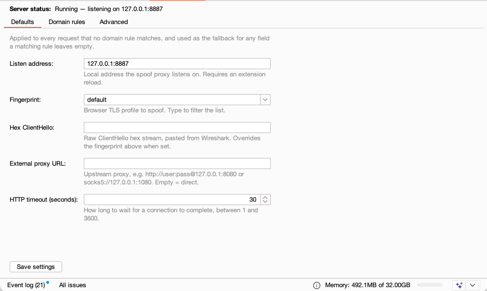
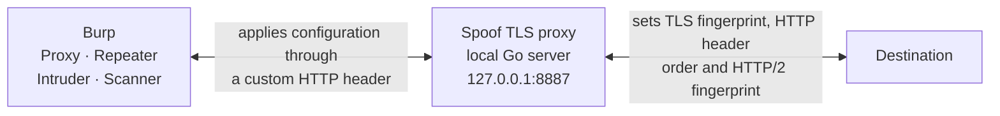
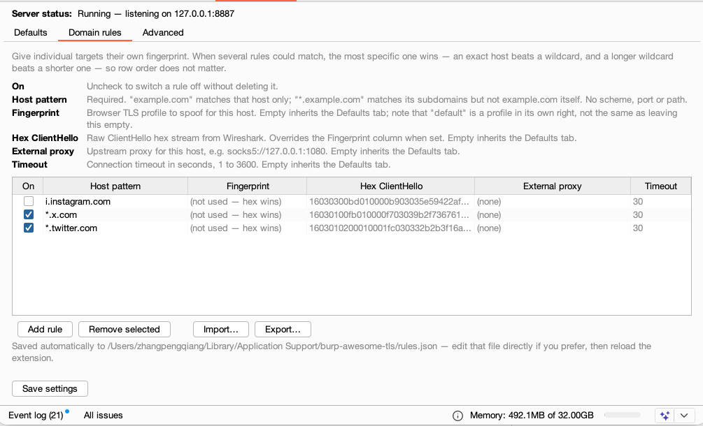
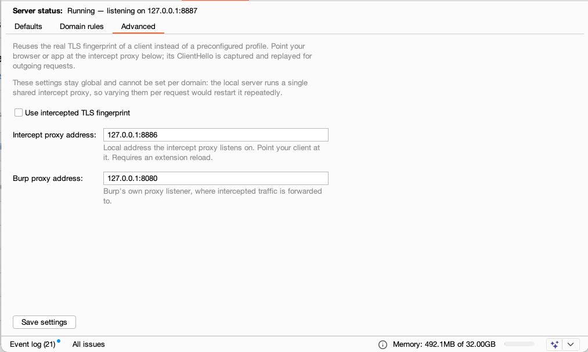
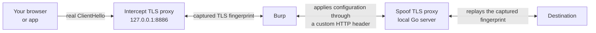

# Awesome TLS — Burp Suite TLS Fingerprint Spoofing Extension

**English** | [简体中文](./README.zh-CN.md)

> **This is a fork of [sleeyax/burp-awesome-tls](https://github.com/sleeyax/burp-awesome-tls).**
> The original extension — its design, its Go/JNA architecture and essentially all of the code this
> builds on — is the work of [@sleeyax](https://github.com/sleeyax) and its contributors.
> This fork continues development on top of it; see [what this fork adds](#what-this-fork-adds).
> Distributed under GPL v3, the same license as upstream.

## What is Awesome TLS?

**Awesome TLS** is a [Burp Suite](https://portswigger.net/burp) extension that **spoofs browser TLS fingerprints** (JA3 / JA4 / ClientHello) so outbound traffic from Burp no longer looks like Java’s default TLS stack.

It is used by security researchers and pentesters to reduce WAF and bot-detection blocks (Cloudflare, PerimeterX, Akamai, DataDome, and similar) while testing with **Proxy, Repeater, Intruder, and Scanner**.

Unlike workarounds that patch Burp or fork Community builds, this extension routes requests through a local Go TLS stack ([utls](https://github.com/refraction-networking/utls) / [tls-client](https://github.com/bogdanfinn/tls-client)) via JNA — no reflection, no private Burp APIs.

| Need | What this extension does |
| --- | --- |
| Burp looks like Java TLS / bot traffic | Spoofs Chrome, Firefox, Safari, mobile, or custom ClientHello fingerprints |
| One global fingerprint is not enough | **Per-domain rules** (exact host or `*.suffix`) with global defaults as fallback |
| Only Proxy should be spoofed | Covers **all Burp tools**: Proxy, Repeater, Intruder, Scanner |
| Cloudflare bot score is low | Improves TLS/HTTP2 fingerprint alignment (see [showcase](#showcase)) |

**Keywords:** Burp Suite extension, TLS fingerprint spoofing, JA3, JA4, ClientHello, Cloudflare bot detection, WAF bypass, utls, HTTP/2 fingerprint, per-domain fingerprint rules.

**Quick links:** [Install](#installation) · [Configuration](#configuration) · [How it works](#how-it-works) · [FAQ](#faq) · [Releases](https://github.com/Robin528919/burp-awesome-tls-plus/releases) · [AI summary (`llms.txt`)](./llms.txt) · [中文文档](./README.zh-CN.md)

---

## What this fork adds

| | Upstream | This fork |
| --- | --- | --- |
| Fingerprint scope | One global setting | Per-domain rules, with the global setting as the fallback |
| Tools covered | Proxy only | Proxy, Repeater, Intruder, Scanner — every tool |
| Rule storage | — | A JSON file outside the Burp project: hand-editable, diffable, shareable |
| Saving | Manual, per tab | Rules save themselves; import/export to move them between machines |

Two bugs from upstream are fixed along the way: the two `Save all settings` buttons each persisted
only their own tab, so editing two tabs and saving from one silently discarded the other; and a
request that failed to process was dropped rather than forwarded.

The settings UI was rewritten as hand-written Swing, styled through Burp's own
`applyThemeToComponent`. The IntelliJ GUI designer form it replaced was never part of the Gradle
build, so it could only be regenerated from inside the IDE.

---

## Sponsors

> Maintenance of the original project is made possible by all the lovely contributors and sponsors.
> If you'd like to sponsor **the upstream project**, click [here](https://github.com/sponsors/sleeyax). 💖

---

## Showcase

[CloudFlare bot score](https://cloudflare.manfredi.io/en/tools/connection):

This is just one example. If you tested with another dedicated bot detection site, let me know your results!

## How it works

Unfortunately Burp's API is very limited for more advanced use cases like this, so I had to play around with it
to make this work.

Once a request comes in, the extension intercepts it and forwards it to a local HTTPS server that started in the
background (once the extension loaded). This applies to traffic from every Burp tool — Proxy, Repeater, Intruder and
Scanner all get the spoofed fingerprint. Burp's own internal traffic is left alone.
This server works like a proxy; it forwards the request to the destination, while persisting the original header order
and applying a customizable TLS configuration.
Then, the local server forwards the response back to Burp.

Configuration settings and other necessary information like the destination server address and protocol are sent to the
local server per request by a magic header.
This magic header is stripped from the request before it's forwarded to the destination server.

> :information_source: Another option would've been to code an upstream proxy server and connect burp to it, but I
> personally needed an extension for customization and portability.

## Installation

1. Download the jar for your OS from **[this fork’s releases](https://github.com/Robin528919/burp-awesome-tls-plus/releases)** (latest: v2.3.x). A fat jar is also published for all supported platforms (portable / USB-friendly).
   Upstream builds: [sleeyax/burp-awesome-tls/releases](https://github.com/sleeyax/burp-awesome-tls/releases).
2. In Burp (Pro or Community): **Extensions → Installed → Add** → extension type **Java** → select the jar → **Next**. It should load without errors.
3. Open the **Awesome TLS** suite tab, pick a fingerprint (or domain rules), and send traffic from Proxy / Repeater / Intruder / Scanner.

## Configuration

This extension is 'plug and play' and should speak for itself. You can hover with your mouse over each field in the '
Awesome TLS' tab for more information about each field.

To load your custom Client Hello from WireShark, you can copy the client hello record as hex stream and paste it
into the field "Hex Client Hello".

What the three tabs are for:

| Tab | Purpose |
| --- | --- |
| **Defaults** | The global settings. Used by any request no domain rule matches, and the fallback for fields a matching rule leaves empty |
| **Domain rules** | Per-domain overrides. Empty cells inherit from Defaults |
| **Advanced** | Captures a client's **real** TLS fingerprint and replays it. Global — it cannot vary per domain |

### Per-domain fingerprints

The 'Domain rules' tab lets you use a different fingerprint per target instead of one global setting.
Each rule matches either an exact host (`example.com`) or its subdomains (`*.example.com`), and can override the
fingerprint, hex ClientHello, external proxy and timeout independently. Any cell left empty inherits the value from
the 'Defaults' tab.

When several rules could match, the most specific one wins: an exact host beats a wildcard, and a longer wildcard
suffix beats a shorter one. Row order does not matter.

Rules save themselves as you edit — there's no need to press 'Save settings' for them. They are stored as plain JSON
outside the Burp project, so they survive project switches and can be edited by hand, kept in version control, or
shared with a team:

| OS | Location |
| --- | --- |
| macOS | `~/Library/Application Support/burp-awesome-tls/rules.json` |
| Linux | `$XDG_CONFIG_HOME/burp-awesome-tls/rules.json` (or `~/.config/...`) |
| Windows | `%AppData%\burp-awesome-tls\rules.json` |

The previous version is always kept alongside it as `rules.json.bak`. Use 'Export…' and 'Import…' to move rules
between machines; importing asks whether to merge with or replace your current rules.

> :information_source: A rule with an incomplete host pattern is highlighted and simply ignored at request time,
> so you can leave one half-finished without breaking anything.

> :information_source: The settings on the 'Advanced' tab stay global. The local server runs a single shared intercept
> proxy, so those values cannot vary per domain.

#### Fingerprint and hex ClientHello are set as a pair

If a row has both a Fingerprint and a Hex ClientHello, **the hex wins and the fingerprint is ignored** — the Go side
always prefers the hex form.

Conversely, a row that sets only a Fingerprint *clears* the hex ClientHello it would otherwise inherit, rather than
combining the two.

The table shows what actually applies: a cell in the normal color is set by that row and in effect, a muted cell is
either inherited from Defaults or not used at all.

> :warning: `default` in the Fingerprint drop-down is a profile in its own right — it is **not** the same as leaving the
> cell empty. Only an empty cell means "inherit from Defaults".

  
Advanced usage

In the 'advanced' tab, you can enable an additional proxy listener that will automatically apply the current fingerprint
from the request:

When enabled, the flow changes to this:

> :warning: This takes priority over everything else. Once enabled and a fingerprint has been captured, it overrides the
> fingerprint of **every** domain rule. If your rules appear to have no effect, check that this switch is off first.

## Manual build Instructions

No particular IDE is required — the settings UI is hand-written Swing, so a JDK and a Go toolchain
are enough. See [workflows](.github/workflows) for the target language versions.

1. Compile the go package within `./src-go/`. Run
   `cd ./src-go/server && go build -o ../../src/main/resources/{OS}-{ARCH}/server.{EXT} -buildmode=c-shared ./cmd/main.go`,
   replacing `{OS}-{ARCH}` with your OS and CPU architecture and `{EXT}` with your platform's preferred extension for
   dynamic C libraries. For example: `linux-x86-64/server.so`. See
   the [JNA docs](https://github.com/java-native-access/jna/blob/master/www/GettingStarted.md) for more info about
   supported platforms.
2. Build the jar with Gradle: `gradle buildJar`.

You should now have one jar file (usually located at `./build/libs`) that works with Burp on your operating system.

## FAQ

### What is a Burp Suite TLS fingerprint spoofing extension?

It is software loaded into Burp Suite that changes the TLS ClientHello (and related HTTP/2 signals) of outgoing requests so remote servers see a browser-like fingerprint instead of Burp’s default Java TLS fingerprint.

### How does Awesome TLS differ from the upstream `sleeyax/burp-awesome-tls`?

This fork keeps the same Go + JNA architecture and adds **per-domain fingerprint rules**, coverage of **all Burp tools** (not only Proxy), **auto-saving rules** in a shareable `rules.json`, and UI/theme fixes. See [what this fork adds](#what-this-fork-adds).

### Does Awesome TLS work with Burp Community Edition?

Yes. Load the Java extension jar in Extender / Extensions the same way as on Burp Professional.

### Can I set different JA3 / TLS fingerprints per host?

Yes. Use the **Domain rules** tab: exact hosts (`example.com`) or wildcards (`*.example.com`). Empty fields inherit **Defaults**. Matching is most-specific-wins (exact > longer wildcard > shorter wildcard); row order does not matter.

### Does it help against Cloudflare, Akamai, DataDome, or PerimeterX?

It improves the **TLS / HTTP fingerprint** layer those systems use. It is not a guarantee of full bot-score success — application behavior, cookies, JS challenges, and IP reputation still matter. See the [Cloudflare bot score showcase](#showcase).

### Which Burp tools get the spoofed fingerprint?

Proxy, Repeater, Intruder, and Scanner. Burp suite-internal traffic (updates, Collaborator polling) is left alone.

### How do I verify the fingerprint after enabling the extension?

Compare against public checkers such as [tls.peet.ws](https://tls.peet.ws/), [tlsfingerprint.io](https://tlsfingerprint.io/), or [scrapfly HTTP/2 fingerprint tools](https://scrapfly.io/web-scraping-tools/http2-fingerprint), and bot-score demos like [Cloudflare connection tools](https://cloudflare.manfredi.io/en/tools/connection).

### Where are domain rules stored?

Outside the Burp project, as JSON:

| OS | Path |
| --- | --- |
| macOS | `~/Library/Application Support/burp-awesome-tls/rules.json` |
| Linux | `$XDG_CONFIG_HOME/burp-awesome-tls/rules.json` (or `~/.config/...`) |
| Windows | `%AppData%\burp-awesome-tls\rules.json` |

### Is this for authorized security testing only?

Yes. Use only on systems you own or have explicit permission to test. WAF evasion techniques must stay within legal and ethical boundaries.

More detail: [docs/faq.md](./docs/faq.md). Machine-readable project summary: [llms.txt](./llms.txt).

## Credits

First and foremost, this project is a fork of
**[sleeyax/burp-awesome-tls](https://github.com/sleeyax/burp-awesome-tls)** by
[@sleeyax](https://github.com/sleeyax) and its
[contributors](https://github.com/sleeyax/burp-awesome-tls/graphs/contributors).

They designed and built the whole thing: the trick of routing Burp's traffic through a local Go
server to escape Burp's own TLS stack, the JNA bridge, the per-request configuration header, the
ClientHello parsing — all of it. This fork only adds features on top of that foundation. If it is
useful to you, go star and sponsor the original.

Special thanks to the maintainers of the following repositories:

- [refraction-networking/utls](https://github.com/refraction-networking/utls)
- [bogdanfinn/tls-client](https://github.com/bogdanfinn/tls-client)

And the creators of the following websites:

- https://tlsfingerprint.io/
- https://kawayiyi.com/tls
- https://tls.peet.ws/
- https://cloudflare.manfredi.io/en/tools/connection
- https://scrapfly.io/web-scraping-tools/http2-fingerprint

## License

[GPL V3](./LICENSE), inherited from the upstream project.

This is a modified version of [sleeyax/burp-awesome-tls](https://github.com/sleeyax/burp-awesome-tls).
The modifications are summarised under [what this fork adds](#what-this-fork-adds) and recorded in
full in the commit history.

## Repository

- **GitHub:** https://github.com/Robin528919/burp-awesome-tls-plus
- **Releases / downloads:** https://github.com/Robin528919/burp-awesome-tls-plus/releases
- **Upstream:** https://github.com/sleeyax/burp-awesome-tls
- **Topics:** `burp-suite`, `tls-fingerprint`, `ja3`, `ja4`, `waf-bypass`, `clienthello`, `utls`
